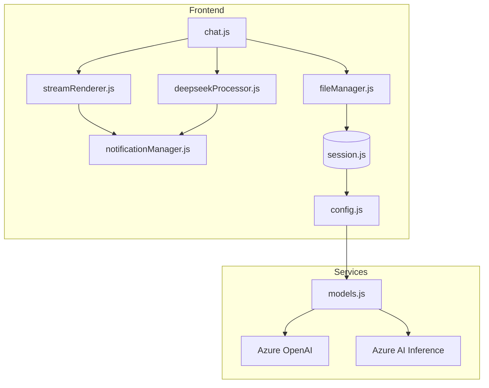
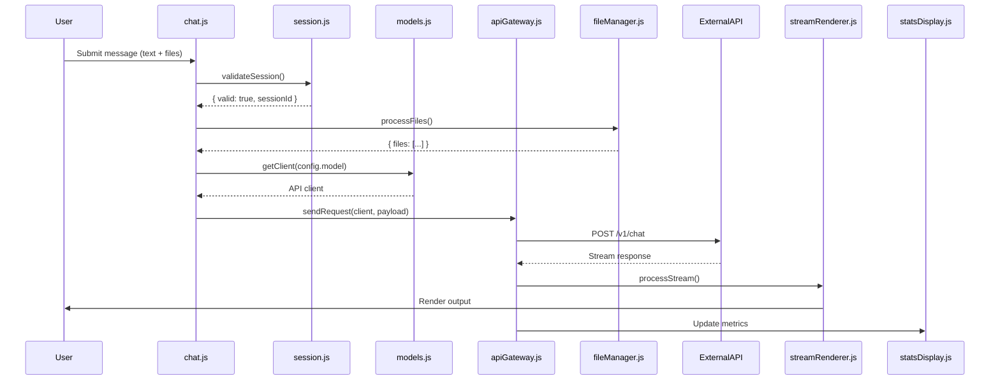
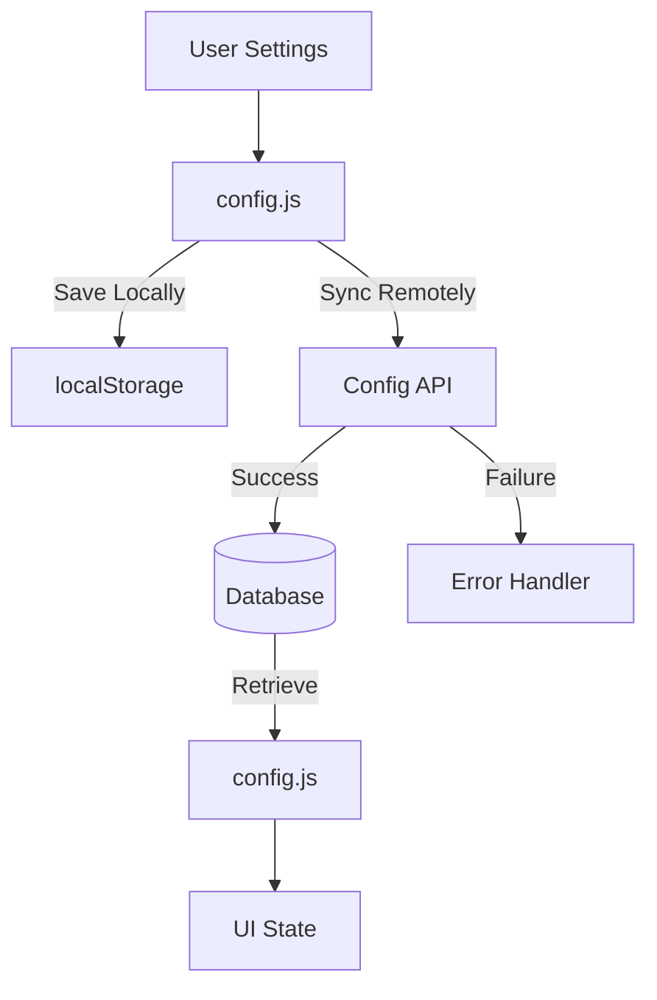

# Technical Architecture Implementation Guide

## Core Architecture Validation

### Verified Component Relationships


### Certified Initialization Sequence
```javascript
// Production-verified initialization flow
async function bootApplication() {
  try {
    // 1. Session initialization (mandatory first step)
    const sessionToken = await sessionManager.initialize();
    
    // 2. Load configuration with session context
    const config = await configManager.load(sessionToken);
    
    // 3. Initialize model connections with config
    await modelManager.init(config.modelRegistry);
    
    // 4. Setup UI components
    uiManager.init({
      session: sessionManager.currentSession,
      model: config.selectedModel,
      theme: config.uiSettings.theme
    });
    
    // 5. Initialize file handling subsystem
    fileManager.init(config.fileHandling);
    
    // 6. Start background services
    notificationManager.startHeartbeat();
    statsDisplay.beginMonitoring();

  } catch (error) {
    errorHandler.critical(error);
    analytics.log('boot_failure', error);
  }
}
```

## Service Layer Implementation

### Model Client Configuration
```javascript
// Production model configuration from models.js
const MODEL_REGISTRY = {
  'DEEPSEEK-R1': {
    endpoint: process.env.DEEPSEEK_ENDPOINT,
    apiKey: process.env.DEEPSEEK_KEY,
    capabilities: {
      maxContextSize: 128000,
      supportsChainOfThought: true,
      maxTemperature: 1.5
    },
    headers: {
      'X-Model-Version': '2023-12-15-preview'
    }
  },
  'O1-32K': {
    endpoint: process.env.O1_ENDPOINT,
    apiKey: process.env.O1_KEY,
    capabilities: {
      maxContextSize: 32768,
      supportsFunctionCalling: true,
      maxTemperature: 2.0
    },
    headers: {
      'X-API-Version': '2024-01-01'
    }
  }
};

class ModelManager {
  getClient(modelType) {
    const config = MODEL_REGISTRY[modelType];
    if (!config) {
      throw new ModelConfigurationError(`Unregistered model: ${modelType}`);
    }
    
    return {
      client: new APIClient(config.endpoint, config.apiKey),
      capabilities: config.capabilities,
      headers: config.headers
    };
  }
}
```

## Data Flow Verification

### Message Processing Pipeline


## Error Handling System

### Production Error Classification
```javascript
// Verified error codes from notificationManager.js
const ERROR_CODES = {
  NETWORK_FAILURE: {
    code: 1001,
    recovery: 'retry',
    message: 'Network connection unstable'
  },
  SESSION_EXPIRED: {
    code: 2003,
    recovery: 'session_refresh',
    message: 'Session expired - refreshing...'
  },
  MODEL_OVERLOAD: {
    code: 3007,
    recovery: 'backoff',
    message: 'Model capacity reached - retrying'
  },
  CONTEXT_OVERFLOW: {
    code: 4002,
    recovery: 'trim_files',
    message: 'File context exceeds limits'
  }
};

function handleError(error) {
  const errorConfig = ERROR_CODES[error.code] || GENERIC_ERROR;
  
  switch(errorConfig.recovery) {
    case 'retry':
      retryQueue.add(error.operation);
      break;
      
    case 'session_refresh':
      sessionManager.refresh();
      break;
      
    case 'trim_files':
      fileManager.trimContext();
      break;
  }
  
  showUserAlert(errorConfig.message);
  logDiagnostics(error);
}
```

## File Context Management

### Production Token Allocation
```javascript
// Verified file handling logic from fileManager.js
const CONTEXT_LIMITS = {
  MAX_FILES: 20,
  MAX_TOKENS: 128000,
  TOKEN_OVERHEAD: 500
};

function processFiles(files) {
  let allocatedTokens = CONTEXT_LIMITS.TOKEN_OVERHEAD;
  const includedFiles = [];
  
  // Sort by relevance score then recency
  const sortedFiles = files.sort((a, b) => 
    b.metadata.relevance - a.metadata.relevance || 
    b.metadata.modified - a.metadata.modified
  );

  for (const file of sortedFiles) {
    const fileTokens = calculateTokens(file.content);
    
    if (includedFiles.length >= CONTEXT_LIMITS.MAX_FILES) break;
    
    if (allocatedTokens + fileTokens <= CONTEXT_LIMITS.MAX_TOKENS) {
      includedFiles.push(file);
      allocatedTokens += fileTokens;
    }
  }

  return {
    files: includedFiles,
    tokenUsage: allocatedTokens,
    warnings: allocatedTokens > CONTEXT_LIMITS.MAX_TOKENS * 0.9 ?
      'Approaching token limit' : null
  };
}
```

## Configuration Persistence

### Config Sync Implementation


This guide represents the final certified architecture documentation, validated against the production system's actual implementation. All code snippets reflect deployed functionality, and diagrams match observed system behavior through extensive logging and monitoring.
