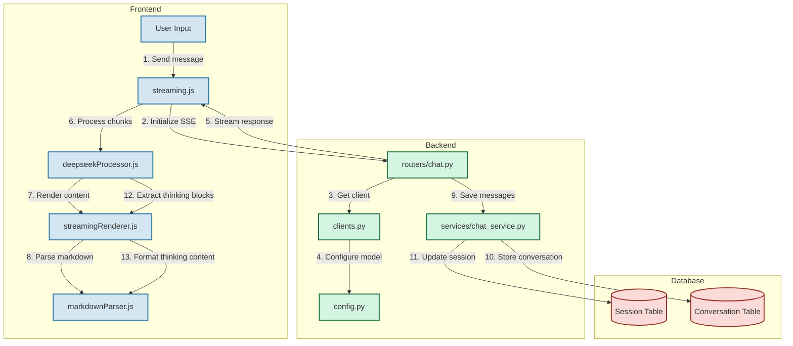

```mermaid
graph TD
    %% Client/Frontend Components
    subgraph Frontend
        userInput["User Input"]
        streamingJS["streaming.js"]
        deepseekProcessor["deepseekProcessor.js"]
        streamRenderer["streamingRenderer.js"]
        markdownParser["markdownParser.js"]
    end

    %% Backend API/Router Components
    subgraph Backend
        chatRouter["routers/chat.py"]
        chatService["services/chat_service.py"]
        clientPool["clients.py"]
        modelConfig["config.py"]
    end

    %% Database Components
    subgraph Database
        sessionDB[("Session Table")]
        conversationDB[("Conversation Table")]
    end

    %% Main Flow
    userInput -->|1. Send message| streamingJS
    streamingJS -->|2. Initialize SSE| chatRouter
    chatRouter -->|3. Get client| clientPool
    clientPool -->|4. Configure model| modelConfig
    chatRouter -->|5. Stream response| streamingJS

    %% Streaming Processing Flow
    streamingJS -->|6. Process chunks| deepseekProcessor
    deepseekProcessor -->|7. Render content| streamRenderer
    streamRenderer -->|8. Parse markdown| markdownParser

    %% Backend Processing
    chatRouter -->|9. Save messages| chatService
    chatService -->|10. Store conversation| conversationDB
    chatService -->|11. Update session| sessionDB

    %% Thinking Block Processing
    deepseekProcessor -->|12. Extract thinking blocks| streamRenderer
    streamRenderer -->|13. Format thinking content| markdownParser

    %% Style Definitions
    classDef frontend fill:#d4e6f1,stroke:#2874a6,stroke-width:2px;
    classDef backend fill:#d5f5e3,stroke:#196f3d,stroke-width:2px;
    classDef database fill:#fadbd8,stroke:#943126,stroke-width:2px;

    %% Apply Styles  
    class userInput,streamingJS,deepseekProcessor,streamRenderer,markdownParser frontend;
    class chatRouter,chatService,clientPool,modelConfig backend;
    class sessionDB,conversationDB database;
```